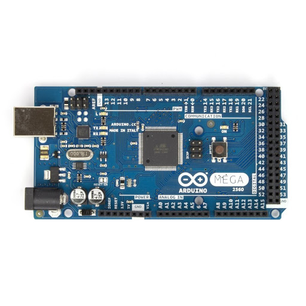
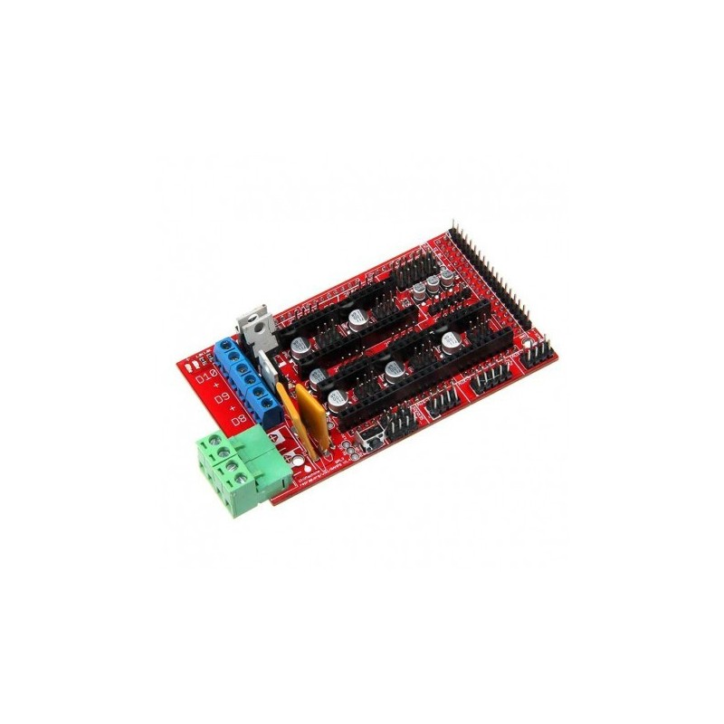
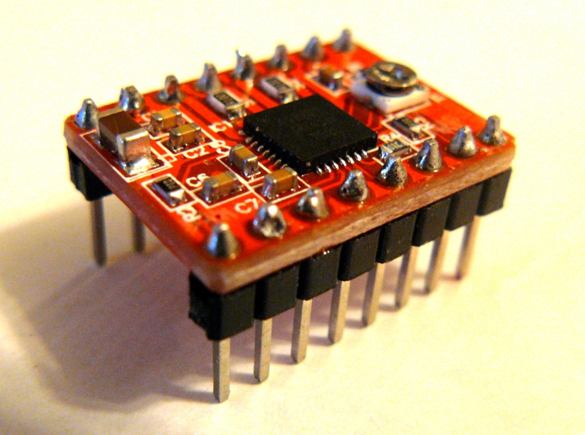
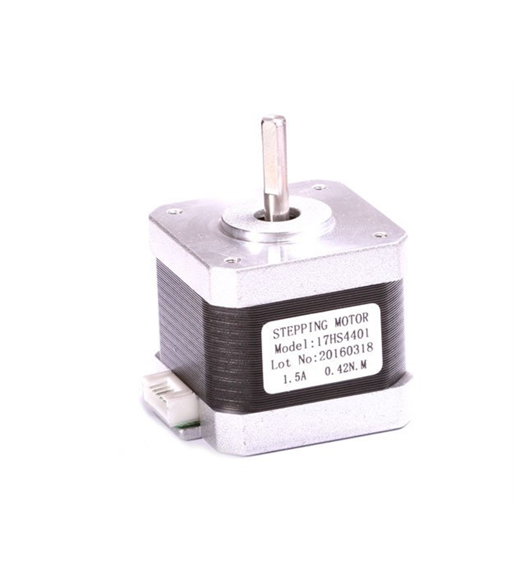

# Análise de Componentes Eletrónicos

**Sumário:**

1.  [A Placa Controladora: O Cérebro da Operação](#1-a-placa-controladora-o-cerebro-da-operacao)
2.  [O Shield de Expansão: O Sistema Nervoso](#2-o-shield-de-expansao-o-sistema-nervoso)
3.  [Drivers de Motor de Passo: Os Músculos Precisos](#3-drivers-de-motor-de-passo-os-musculos-precisos)
4.  [Motores de Passo: Os Atuadores](#4-motores-de-passo-os-atuadores)

Nesta fase da investigação, vamos dissecar cada componente eletrónico principal. O objetivo é construir um "datasheet" do nosso projeto, com um entendimento fundamental da função, princípio de operação e especificações elétricas de cada parte.

---

### 1. A Placa Controladora: O Cérebro da Operação

*   **Componente:** Arduino Mega 2560
*   **Datasheet:** [Mega 2560 Rev3 | Arduino Documentation](https://docs.arduino.cc/hardware/mega-2560/#features)
*   **Especificações Elétricas:**
    *   **Tensão de Operação (Lógica):** 5V
    *   **Tensão de Entrada (Recomendada):** 7-12V (via pino VIN ou Jack)
    *   **Corrente de Operação (Controlador):** ~80mA
*   **Função no Ecossistema:** A placa controladora é o centro nevrálgico da impressora. Sua função primária é executar o firmware, um software de baixo nível que interpreta comandos (G-code) e os traduz em ações físicas, como mover motores, ler sensores e controlar temperaturas.
*   **Princípio de Funcionamento:** O Arduino Mega é uma plataforma de prototipagem eletrónica de código aberto baseada em um microcontrolador ATmega2560. Ele possui um grande número de pinos de entrada/saída (I/O) que são essenciais para conectar todos os outros periféricos da impressora. O firmware (ex: Marlin) é carregado em sua memória, e o microcontrolador executa esse código em um loop contínuo, lendo entradas e atualizando saídas milhares de vezes por segundo.
*   **Justificativa da Escolha:** A combinação Arduino Mega + RAMPS foi, por muitos anos, o padrão de fato para impressoras 3D DIY devido ao seu baixo custo, vasta documentação e enorme apoio da comunidade. Embora hoje existam placas de 32 bits mais avançadas, esta combinação de 8 bits ainda é extremamente capaz e uma excelente plataforma de aprendizado.

---

### 2. O Shield de Expansão: O Sistema Nervoso

*   **Componente:** RAMPS 1.4 (RepRap Arduino Mega Pololu Shield)
*   **Datasheet:** [RepRap Wiki para RAMPS 1.4](https://reprap.org/wiki/RAMPS_1.4)
*   **Especificações Elétricas:**
    *   **Tensão de Entrada (Motores e Lógica):** 12V (pode ser modificada para 24V)
    *   **Corrente Máx (Cama Aquecida):** 11A (protegido por fusível)
    *   **Corrente Máx (Outros Circuitos):** 5A (protegido por fusível)
*   **Função no Ecossistema:** Se o Arduino é o cérebro, a RAMPS é o sistema nervoso central, distribuindo os sinais para as partes móveis. É um "shield" que se encaixa sobre o Arduino, fornecendo conectores específicos e convenientes para todos os componentes da impressora: motores, endstops, termistores e aquecedores.
*   **Princípio de Funcionamento:** A RAMPS é essencialmente uma placa de circuito impresso (PCB) que roteia os pinos do Arduino para soquetes modulares. Ela também inclui circuitos de potência (MOSFETs) para controlar os componentes de alta corrente, como a cama aquecida (heated bed) e o bico aquecedor (hotend), que não poderiam ser alimentados diretamente pelos pinos do Arduino.
*   **Justificativa da Escolha:** Modularidade. A capacidade de substituir facilmente os drivers de motor de passo (veja abaixo) sem precisar trocar a placa inteira é uma grande vantagem para a manutenção e experimentação.

---

### 3. Drivers de Motor de Passo: Os Músculos Precisos

*   **Componente:** A4988 ou DRV8825
*   **Quantidade:** 5 (Recomenda-se ter 1 ou 2 extras para substituição)
*   **Distribuição de Funções:**
    *   **Driver 1:** Eixo X
    *   **Driver 2:** Eixo Y
    *   **Driver 3:** Eixo Z (controla os dois motores do eixo Z em paralelo)
    *   **Driver 4:** Extrusor 0
    *   **Driver 5:** Extrusor 1 (se aplicável, senão fica de reserva)
*   **Datasheet:** [A4988 Stepper Driver Board | Gogo:Tronics](https://sparks.gogo.co.nz/stepstick/index.html)
*   **Especificações Elétricas:**
    *   **Tensão de Operação (Lógica):** 3 - 5.5V
    *   **Tensão de Alimentação do Motor:** 8 - 35V
    *   **Corrente de Saída (Ajustável):** Até 1.5A contínuo por fase (A4988, com dissipador), ~2.2A (DRV8825)
*   **Função no Ecossistema:** Controlam a corrente que flui para as bobinas dos motores de passo, permitindo um controle extremamente preciso sobre a rotação do motor.
*   **Princípio de Funcionamento:** Estes pequenos módulos recebem dois sinais da placa controladora: `STEP` e `DIR` (passo e direção). Para cada pulso no pino `STEP`, o motor avança um "micropasso". O pino `DIR` determina a direção da rotação. A grande vantagem é o "microstepping", que divide um passo completo do motor em muitos micropassos menores (1/16 para o A4988, 1/32 para o DRV8825), resultando em movimentos mais suaves e precisos. A corrente é ativamente limitada pelo driver, ajustada por um potenciômetro (Vref).
*   **Justificativa da Escolha:** São soluções de baixo custo, fáceis de encontrar e muito bem documentadas. A diferença principal entre o A4988 e o DRV8825 reside na resolução de micropassos e na corrente que podem fornecer.

---

### 4. Motores de Passo: Os Atuadores

*   **Componente:** NEMA 17HS4401-22B
*   **Quantidade:** 5
*   **Distribuição de Funções:**
    *   **Motor 1:** Eixo X
    *   **Motor 2:** Eixo Y
    *   **Motores 3 e 4:** Eixo Z (um para cada lado do eixo)
    *   **Motor 5:** Extrusor
*   **Datasheet:** [Datasheet NEMA 17HS4401](https://www.datasheetcafe.com/17hs4401-datasheet-nema-17-stepper-motor/)
*   **Especificações Elétricas:**
    *   **Tensão Nominal:** DC 3.6V (Nota: será alimentado com 12V, o driver limita a corrente)
    *   **Corrente Nominal por Fase:** 1.5A (Pode variar ligeiramente, verifique o datasheet do seu motor específico)
    *   **Ângulo do Passo:** 1.8 graus
*   **Função no Ecossistema:** Convertem sinais elétricos em movimento rotacional preciso, que é então transformado em movimento linear pelos eixos da impressora.
*   **Princípio de Funcionamento:** Um motor de passo é um motor DC "brushless" (sem escovas) que divide uma rotação completa em um número de passos iguais (200 no caso de um motor de 1.8 graus). A posição do motor pode ser comandada para mover e manter em um desses passos sem um sensor de posição (controle em malha aberta), o que simplifica o projeto. A alimentação com tensão superior à nominal (ex: 12V vs 3.6V) permite que a corrente seja atingida mais rapidamente nas bobinas, melhorando o torque em altas velocidades.
*   **Justificativa da Escolha:** O padrão NEMA 17 define as dimensões da face de montagem do motor (1.7 x 1.7 polegadas). É o tamanho mais comum para impressoras 3D de mesa, oferecendo um bom equilíbrio entre torque e tamanho. O modelo 17HS4401-22B é uma variante popular com boas características para esta aplicação.
